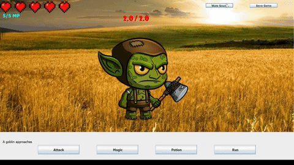

# Mental-Math-Game
A turn-based game where you need to answer math questions to attack the enemy made using Java. ([Demo Video](https://youtu.be/xOqi7ggbNU8))

By [Ethan Saunders](https://github.com/esaundere) 
Course: Computer Science ICS4UD (Grade 12 IB program course)  
Date: January 20th, 2020  
Grade: 96% (level 6)

  

## Table of Contents
[1. Intro](#Intro)  
[2. Gameplay](#Gameplay)  
[3. Environment Setup](#Environment-Setup)  
[4. How to Play](#How-to-Play)  
[5. Results](#Results)  
[6. Next Steps](#Next-Steps)  
[7. Development Changelog](#Development-Changelog)

## Intro

I was inspired to make this game for my IB project with the goal to make an enjoyable way to practice mental math for kids. The game has basic turn based gameplay but to properly attack, the user must answer a math question in a set amount of time. Various difficulties were implemented to ensure people of different skill levels can enjoy the game.

This game was made using Java. It utilizes basic object-oriented programming and a variety of other techniques.

## Gameplay

Check out the demo video for this project [here](https://youtu.be/xOqi7ggbNU8)!

  

## Environment Setup

To successfully run this project, please follow these steps to set up your environment:

1. Any IDE that runs Java (I recommend [IntelliJ IDEA](https://www.jetbrains.com/idea/), [JCreator](https://www.deepcrazyworld.com/how-to-download-jcreator-pro/) or [VS Code](https://code.visualstudio.com/download))
2. Java SE 8 (which includes JDK 1.8.0_333) ([Download from Oracle](https://www.oracle.com/java/technologies/javase/javase8u211-later-archive-downloads.html))
3. Ensure your IDE is configured to use the above version of Java SE and JDK

## How to Play

Simply click on the buttons and enter data into the text boxes to play.

Run the [mainCoding.java](mainCoding.java) file to play!

You can save your data at any time and if you want, you can edit your save data in the file Save.txt.

## Results

This project turned out quite well considering my limited knowledge of Java when starting this project.

I learned how to utilize a variety of different Java classes and developed my problem solving and troubleshooting skills through the development process which has set me up for success in my university programming courses.

**Grade: 96% (level 6 from IB)**

## Next Steps
Some potential improvements that I can see myself making in the future:

- An expanded shop that allows a player to upgrade their damage and defense
- An improved health bar to allow for more flexibility when programming encounters
- Improved animations as the current animations are not good (simply shifting images)
- Add a player character to the screen and possibly even add other party members to allow for harder fights and more diverse attacks
- Add special enemy attacks and a guard ability to make combat more complex
- Allow the player to move around a map instead of following the on-the-rails combat encounter, transitioning into a proper turn-based rpg

These changes are significant but they will definitely improve the game by a large amount.

## Development Changelog
November 12th, 2019: Project outline drafted

November 15th, 2019: I researched how to make a GUI in Java.

November 17th, 2019: Implemented 4 buttons and the textbox that will be used for all of the game's interactive elements.

November 19th, 2019: Developed the gameplay loop strucure that loops through several arrays that provide the strings and data required for each encounter.

November 22nd, 2019: Created the math question generator function and tested it to ensure the answers to the output questions are correct.

November 25th, 2019: Added health and mp values and added a game reset when a game over occurs. Tested gameplay loop to ensure it functions as intended.

November 27th, 2019: Added the ability to add shops to the game and the ability to collect and spend gold to buy potions.

November 30th, 2019: Researched how to display images and collected images for the enemies, background, and health bar.

December 2nd, 2019: Images and enemy data are stored in arrays and I ensure images are displaying properly in the program.

December 4th, 2019: Health bar is added using hearts and I start development on the Music class.

December 6th, 2019: Music class is completed and a music array is created to store the file names of the .wav files.

December 10th, 2019: A timer is implemented to add some very basic animation

December 11th, 2019: Enemy images are changed to move up and down now. Attack animations are added as well.

January 6th, 2020: Major bugs are resolved and testing begins.

January 20th, 2020: Project finished and submitted.
